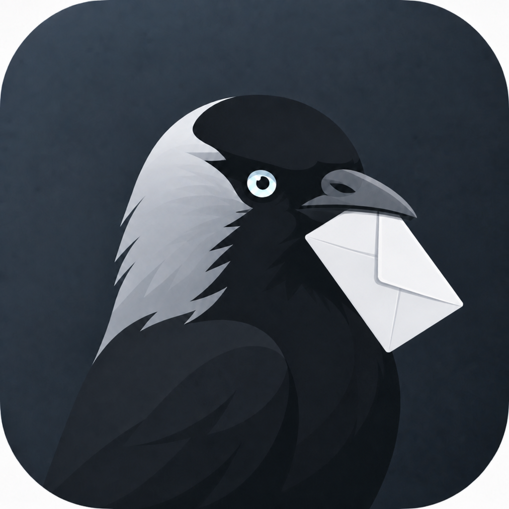

<div align="center">



# Jackdaw

**Почта · Календарь · Контакты**

Desktop-клиент для Exchange / OWA и связанных протоколов.

[](LICENSE)


[Русский](#-русский) · [English](#-english) · [Сайт](https://jackdaw.app)

</div>

---

## 🇷🇺 Русский

### О проекте

**Jackdaw** — почтовый клиент с календарём и адресной книгой для Exchange / OWA, EWS, ActiveSync, Graph, IMAP/JMAP и CardDAV/CalDAV.

**Electron** (desktop) + **Capacitor** (mobile), UI на **Svelte + TypeScript**.

### Происхождение

Jackdaw — **продолжение и переработка** open-source почтового клиента под [EUPL-1.2](LICENSE).

Исходная кодовая база — работа **Ben Bucksch**, **Beonex GmbH** и других участников. Проект **не писался с нуля**: взята существующая основа, исправлено то, что не работало, добавлены новые возможности.

**Сейчас Jackdaw развивает [uugsx](https://github.com/Uugsx)** — ребрендинг, стабилизация, UI, протоколы OWA.

> EUPL разрешает форк и доработку. При распространении нужно сохранять лицензию и указание авторов исходника — см. [LICENSE](LICENSE).

### Что добавлено в Jackdaw

Доработки поверх исходного клиента — **активная разработка**, список растёт:

- **OWA shared mailboxes** — синхронизация дополнительных ящиков: письма, категории, уведомления *(ключевая фича)*
- **Боковая панель** — виджеты, календарь, встроенные web-панели (Gemini и др.)
- **Переработанный UI** — брендинг Jackdaw, почтовые layout'ы (широкий табличный / 3-pane), лента, ribbon, плавающий композер
- **Почта** — тёмная тема HTML-писем, комбинации категорий OWA, undo удаления, дерево папок, quick filters
- **Стабилизация** — исправления OWA sync, стартовые папки, splitter'ы, то, что в upstream работало криво

**В планах:** OTA-обновления из Git, сайт [jackdaw.app](https://jackdaw.app), полировка панелей и тулбара, дальнейшие OWA-фичи.

### Возможности

| Модуль | Что умеет |
|--------|-----------|
| **Почта** | Папки, поиск, теги/категории OWA, композер, тёмная тема писем, undo удаления, shared OWA mailboxes, ribbon, floating compose |
| **UI** | Боковая панель виджетов, переработанные layout'ы, Jackdaw theme |
| **Календарь** | События, приглашения, онлайн-встречи |
| **Контакты** | Личные и GAL-контакты, группы |
| **Файлы** | WebDAV / Nextcloud |
| **Meet** | Видеозвонки *(proprietary)* |

### Платформы

| Платформа | Статус |
|-----------|--------|
| macOS (arm64 / universal) | ✅ основная |
| Windows / Linux | ✅ desktop |
| iOS / Android | 🚧 mobile |

### Сборка (dev)

```bash
# зависимости
(cd app && npm install)
(cd desktop && npm install)
(cd desktop/backend && npm install)

# терминал 1 — UI
cd app && npm run dev

# терминал 2 — Electron
cd desktop && npm run dev
```

**Release (macOS):**

```bash
cd app && npm run build
cd desktop && npm run build:mac
```

Подробнее: [`docs/INSTALL.md`](docs/INSTALL.md) · [`docs/systems/desktop-build/`](docs/systems/desktop-build/)

### Структура репозитория

```
app/        — Svelte UI + бизнес-логика
desktop/    — Electron shell + backend
mobile/     — Capacitor (iOS / Android)
docs/       — документация по сборке и архитектуре
lib/        — общие библиотеки (JPC protocol)
```

### Лицензия

[EUPL-1.2](LICENSE) — форк и доработка разрешены. Копирайт исходных авторов (Ben Bucksch, Beonex GmbH) сохранён. Отдельные модули (Exchange, WebMail, Meet) — proprietary, см. LICENSE.

### Контакты

- **Maintainer:** [uugsx](https://github.com/Uugsx)
- **Сайт:** [jackdaw.app](https://jackdaw.app)
- **Репозиторий:** [github.com/Uugsx/Jackdaw](https://github.com/Uugsx/Jackdaw)

---

## 🇬🇧 English

### About

**Jackdaw** is a mail client with calendar and contacts for Exchange / OWA, EWS, ActiveSync, Graph, IMAP/JMAP, and CardDAV/CalDAV.

**Electron** (desktop) + **Capacitor** (mobile), **Svelte + TypeScript** UI.

### Origin

Jackdaw is a **continued fork and rework** of an open-source mail client under [EUPL-1.2](LICENSE).

The original codebase is the work of **Ben Bucksch**, **Beonex GmbH**, and other contributors. Jackdaw was **not written from scratch** — the existing foundation was taken forward, broken parts were fixed, and new features were added.

**Jackdaw is now maintained by [uugsx](https://github.com/Uugsx)** — rebranding, stabilization, UI, and OWA protocol work.

> EUPL allows forking and modification. Distribution requires keeping the license and upstream attribution — see [LICENSE](LICENSE).

### What's new in Jackdaw

Work on top of the original client — **active development**, list keeps growing:

- **OWA shared mailboxes** — sync delegated mailboxes: messages, categories, notifications *(flagship feature)*
- **Sidebar panel** — widgets, mini-calendar, embedded web panels (Gemini, etc.)
- **Redesigned UI** — Jackdaw branding, mail layouts (wide table / 3-pane), ribbon, floating composer
- **Mail** — dark-mode HTML rendering, OWA category combinations, delete undo, folder tree, quick filters
- **Stabilization** — OWA sync fixes, startup folders, splitters, broken upstream behaviour fixed

**Roadmap:** OTA updates from Git, [jackdaw.app](https://jackdaw.app) website, sidebar/toolbar polish, more OWA features.

### Features

| Module | Highlights |
|--------|------------|
| **Mail** | Folders, search, OWA categories/tags, composer, dark-mode email rendering, delete undo, shared OWA mailboxes, ribbon, floating compose |
| **UI** | Widget sidebar, reworked layouts, Jackdaw theme |
| **Calendar** | Events, invitations, online meetings |
| **Contacts** | Personal & GAL contacts, groups |
| **Files** | WebDAV / Nextcloud |
| **Meet** | Video calls *(proprietary)* |

### Platforms

| Platform | Status |
|----------|--------|
| macOS (arm64 / universal) | ✅ primary |
| Windows / Linux | ✅ desktop |
| iOS / Android | 🚧 mobile |

### Build (dev)

```bash
# install dependencies
(cd app && npm install)
(cd desktop && npm install)
(cd desktop/backend && npm install)

# terminal 1 — UI
cd app && npm run dev

# terminal 2 — Electron shell
cd desktop && npm run dev
```

**Release (macOS):**

```bash
cd app && npm run build
cd desktop && npm run build:mac
```

See also: [`docs/INSTALL.md`](docs/INSTALL.md) · [`docs/systems/desktop-build/`](docs/systems/desktop-build/)

### Repository layout

```
app/        — Svelte UI + business logic
desktop/    — Electron shell + backend
mobile/     — Capacitor (iOS / Android)
docs/       — build & architecture docs
lib/        — shared libraries (JPC protocol)
```

### License

[EUPL-1.2](LICENSE) — forking and modification allowed. Original authors' copyright (Ben Bucksch, Beonex GmbH) retained. Some modules (Exchange, WebMail, Meet) are proprietary — see LICENSE.

### Links

- **Maintainer:** [uugsx](https://github.com/Uugsx)
- **Website:** [jackdaw.app](https://jackdaw.app)
- **Repository:** [github.com/Uugsx/Jackdaw](https://github.com/Uugsx/Jackdaw)

---

<div align="center">

<sub>Jackdaw · EUPL fork, maintained by <a href="https://github.com/Uugsx">uugsx</a> · Private repository</sub>

</div>
