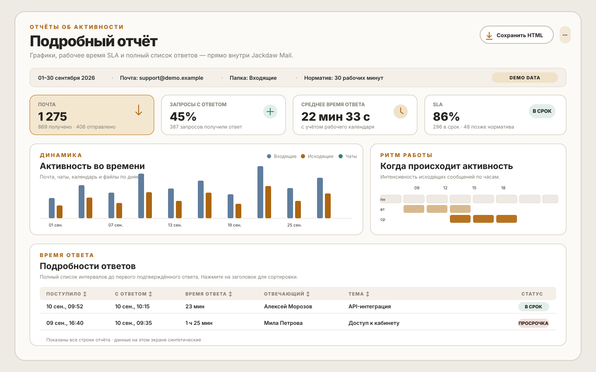
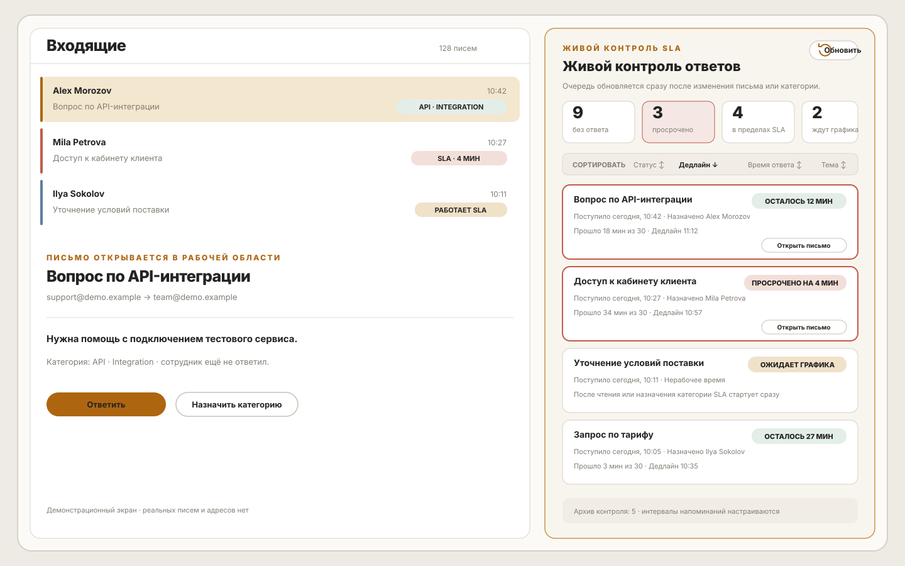

<div align="center">


# Jackdaw

**Почта · Календарь · Контакты · SLA-отчёты**

Desktop-клиент для Exchange / OWA и связанных протоколов с интерактивными отчётами и живым контролем SLA.

[](LICENSE)


[Русский](#-русский) · [English](#-english) · [Сайт](https://jackdaw.app)

</div>

---

## Визуальный обзор

Отчёты открываются внутри Jackdaw как полноценная рабочая страница: графики, таблицы и сортировка доступны до сохранения копии в HTML. Живой контроль SLA можно держать в правой боковой панели рядом с открытым письмом.

Все данные на превью ниже синтетические: используются только вымышленные имена, темы и адрес `demo.example`. Реальные почтовые аккаунты, адреса и содержимое писем в репозиторий не добавляются.

<p align="center">
  
</p>

<p align="center">
  
</p>

<p align="center"><sub>Демонстрационные экраны · synthetic demo data</sub></p>

## 🇷🇺 Русский

### О проекте

**Jackdaw** — почтовый клиент с календарём и адресной книгой для Exchange / OWA, EWS, ActiveSync, Graph, IMAP/JMAP и CardDAV/CalDAV.

Desktop на **Electron**, mobile на **Capacitor**, UI — **Svelte + TypeScript**. Разработка — **[uugsx](https://github.com/Uugsx)**.

### Особенности

- **OWA shared mailboxes** — синхронизация дополнительных ящиков: письма, категории, уведомления
- **Боковая панель** — виджеты, календарь, встроенные web-панели
- **Обновлённый UI** — layout'ы почты, ribbon, плавающий композер, тема Jackdaw
- **Почта** — тёмная тема HTML-писем, категории OWA, undo удаления, дерево папок
- **Отчёты и SLA** — интерактивный дашборд, рабочий календарь по дням недели, живой таймер ответа и настраиваемые напоминания
- **Desktop OTA** — автообновление через GitHub Releases (Mac + Windows); см. [`docs/systems/desktop-build/ota-jackdaw.md`](docs/systems/desktop-build/ota-jackdaw.md)
- **Roadmap** — [jackdaw.app](https://jackdaw.app), дальнейшие OWA-фичи

### Возможности

| Модуль | Что умеет |
|--------|-----------|
| **Почта** | Папки, поиск, теги/категории OWA, композер, тёмная тема писем, undo удаления, shared OWA mailboxes, ribbon, floating compose |
| **UI** | Боковая панель виджетов, переработанные layout'ы, Jackdaw theme |
| **Отчёты и SLA** | Интерактивные графики и таблицы, сортировка, фильтры ящика/папки/категорий, рабочие часы по каждому дню, живой контроль и HTML-экспорт |
| **Календарь** | События, приглашения, онлайн-встречи |
| **Контакты** | Личные и GAL-контакты, группы |
| **Файлы** | WebDAV / Nextcloud |
| **Meet** | Видеозвонки *(proprietary)* |

### Отчёты и живой контроль SLA

Отчёт сначала формируется и просматривается прямо в приложении. HTML — необязательная сохранённая копия, которую можно скачать после проверки данных.

- **Дашборд:** сводные карточки, активность во времени, тепловая карта рабочего ритма, скорость первого ответа, частые запросы, категории и теги, календарная загрузка и подробные таблицы.
- **Фильтры:** период, почтовый аккаунт, папка, норматив в рабочих минутах и категории, попавшие в отчёт.
- **Ответственный:** группировка по почтовому профилю или по именным категориям сотрудников с выбором конкретных категорий.
- **Рабочий календарь:** отдельные часы начала и конца для каждого дня недели; выходные и время вне графика не увеличивают SLA.
- **Корректный расчёт:** время ответа считается до первого подтверждённого ответа, найденного на сервере или в связанном отправленном письме. Ответы без рабочего интервала помечаются как «вне рабочего времени» и не искажают средние показатели.
- **Живая очередь:** новые неотвеченные письма появляются в правой боковой панели рядом с почтой. Для каждого письма видны статус, прошедшее время, дедлайн и оставшееся время.
- **Старт SLA:** письмо, пришедшее в рабочие часы, начинает отсчёт сразу. Нерабочее письмо ждёт рабочего графика, пока его не прочитают или не назначат ему категорию — после этого заданный норматив начинает идти немедленно.
- **Напоминания:** интервалы задаются в рабочих минутах (например, 10, 20 и 25), каждое уведомление приходит один раз до появления ответа и открывает нужное письмо.
- **Правила очереди:** можно исключить категории вроде «Переписка (мы в копии)», отдельно включить или не включать письма без категории, сортировать очередь и убрать неактуальное письмо в архив контроля с возможностью восстановления.

Настройки живого контроля сохраняются отдельно для выбранного почтового ящика. Очередь обновляется сразу после изменения письма или категории; периодическая проверка служит резервным механизмом.

### Платформы

| Платформа | Статус |
|-----------|--------|
| macOS (arm64 / universal) | ✅ основная |
| Windows / Linux | ✅ desktop |
| iOS / Android | 🚧 mobile |

### Сборка (dev)

```bash
# зависимости
(cd app && npm install)
(cd desktop && npm install)
(cd desktop/backend && npm install)

# терминал 1 — UI
cd app && npm run dev

# терминал 2 — Electron
cd desktop && npm run dev
```

**Release (macOS):**

```bash
cd app && npm run build
cd desktop && npm run build:mac
```

Подробнее: [`docs/INSTALL.md`](docs/INSTALL.md) · [`docs/systems/desktop-build/`](docs/systems/desktop-build/) · **OTA:** [`ota-jackdaw.md`](docs/systems/desktop-build/ota-jackdaw.md)

### Структура репозитория

```
app/        — Svelte UI + бизнес-логика
desktop/    — Electron shell + backend
mobile/     — Capacitor (iOS / Android)
docs/       — документация по сборке и архитектуре
lib/        — общие библиотеки (JPC protocol)
```

### Лицензия

[EUPL-1.2](LICENSE). Отдельные модули (Exchange, WebMail, Meet) — proprietary, см. LICENSE.

### Контакты

- **Maintainer:** [uugsx](https://github.com/Uugsx)
- **Сайт:** [jackdaw.app](https://jackdaw.app)
- **Репозиторий:** [github.com/Uugsx/Jackdaw](https://github.com/Uugsx/Jackdaw)

---

## 🇬🇧 English

### About

**Jackdaw** is a mail client with calendar, contacts, interactive reports and live SLA control for Exchange / OWA, EWS, ActiveSync, Graph, IMAP/JMAP, and CardDAV/CalDAV.

**Electron** desktop, **Capacitor** mobile, **Svelte + TypeScript** UI. Maintained by **[uugsx](https://github.com/Uugsx)**.

### Highlights

- **OWA shared mailboxes** — delegated inboxes: messages, categories, notifications
- **Sidebar** — widgets, mini-calendar, embedded web panels
- **Updated UI** — mail layouts, ribbon, floating composer, Jackdaw theme
- **Mail** — dark-mode HTML, OWA categories, delete undo, folder tree
- **Reports & SLA** — interactive dashboard, per-weekday working calendar, live response timers and configurable reminders
- **Desktop OTA** — auto-update via GitHub Releases (Mac + Windows); see [`docs/systems/desktop-build/ota-jackdaw.md`](docs/systems/desktop-build/ota-jackdaw.md)
- **Roadmap** — [jackdaw.app](https://jackdaw.app), more OWA work

### Features

| Module | Highlights |
|--------|------------|
| **Mail** | Folders, search, OWA categories/tags, composer, dark-mode email rendering, delete undo, shared OWA mailboxes, ribbon, floating compose |
| **UI** | Widget sidebar, reworked layouts, Jackdaw theme |
| **Reports & SLA** | Interactive charts and tables, sorting, mailbox/folder/category filters, per-day working hours, live response control and HTML export |
| **Calendar** | Events, invitations, online meetings |
| **Contacts** | Personal & GAL contacts, groups |
| **Files** | WebDAV / Nextcloud |
| **Meet** | Video calls *(proprietary)* |

### Reports and live SLA control

Reports are generated and reviewed inside the app first. HTML is an optional saved copy that can be downloaded after the data has been checked.

- **Dashboard:** summary cards, activity over time, work-rhythm heatmap, first-response speed, frequent requests, categories and tags, calendar load, and detailed tables.
- **Filters:** date range, mailbox, folder, response target in working minutes, and the categories included in the report.
- **Responder attribution:** group results by mailbox profile or by named employee categories, with an explicit category selection.
- **Working calendar:** set a different start and end time for every weekday; weekends and time outside the schedule do not add SLA time.
- **Reliable timing:** response time ends at the first confirmed reply found by the server or in a linked sent message. Replies with no working interval are marked outside working hours and kept out of averages.
- **Live queue:** unanswered mail appears in the right sidebar next to the open message. Each item shows status, elapsed time, deadline, and remaining time.
- **SLA start:** mail received during working hours starts immediately. Mail received outside the schedule waits until the workday unless it is read or assigned an employee category; then the target starts at once.
- **Reminders:** configure working-minute checkpoints such as 10, 20 and 25; each reminder is shown once until the request receives a reply and opens the relevant message.
- **Queue rules:** exclude categories such as “Переписка (мы в копии)”, choose whether uncategorized messages are included, sort the queue, and archive stale requests with restore support.

Live-control settings are persisted per mailbox. The queue refreshes immediately after a message or category change, with a periodic safety check as a fallback.

### Platforms

| Platform | Status |
|----------|--------|
| macOS (arm64 / universal) | ✅ primary |
| Windows / Linux | ✅ desktop |
| iOS / Android | 🚧 mobile |

### Build (dev)

```bash
# install dependencies
(cd app && npm install)
(cd desktop && npm install)
(cd desktop/backend && npm install)

# terminal 1 — UI
cd app && npm run dev

# terminal 2 — Electron shell
cd desktop && npm run dev
```

**Release (macOS):**

```bash
cd app && npm run build
cd desktop && npm run build:mac
```

See also: [`docs/INSTALL.md`](docs/INSTALL.md) · [`docs/systems/desktop-build/`](docs/systems/desktop-build/) · **OTA:** [`ota-jackdaw.md`](docs/systems/desktop-build/ota-jackdaw.md)

### Repository layout

```
app/        — Svelte UI + business logic
desktop/    — Electron shell + backend
mobile/     — Capacitor (iOS / Android)
docs/       — build & architecture docs
lib/        — shared libraries (JPC protocol)
```

### License

[EUPL-1.2](LICENSE). Some modules (Exchange, WebMail, Meet) are proprietary — see LICENSE.

### Links

- **Maintainer:** [uugsx](https://github.com/Uugsx)
- **Website:** [jackdaw.app](https://jackdaw.app)
- **Repository:** [github.com/Uugsx/Jackdaw](https://github.com/Uugsx/Jackdaw)

---

<div align="center">

<sub>Jackdaw · <a href="https://github.com/Uugsx">uugsx</a> · <a href="LICENSE">EUPL-1.2</a></sub><br>
<sub>Based on prior open-source work by Ben Bucksch, Beonex GmbH and contributors.</sub>

</div>
