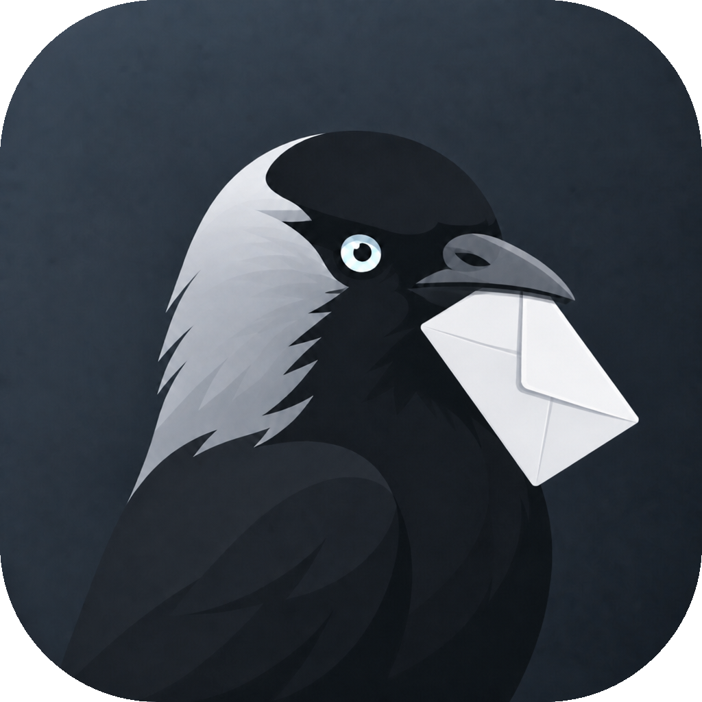

<div align="center">



# Jackdaw

**Почта · Календарь · Контакты**

Desktop-клиент для Exchange / OWA и связанных протоколов.

[](LICENSE)


[Русский](#-русский) · [English](#-english) · [Сайт](https://jackdaw.app)

</div>

---

## 🇷🇺 Русский

### О проекте

**Jackdaw** — почтовый клиент с календарём и адресной книгой для Exchange / OWA, EWS, ActiveSync, Graph, IMAP/JMAP и CardDAV/CalDAV.

Desktop на **Electron**, mobile на **Capacitor**, UI — **Svelte + TypeScript**. Разработка — **[uugsx](https://github.com/Uugsx)**.

### Особенности

- **OWA shared mailboxes** — синхронизация дополнительных ящиков: письма, категории, уведомления
- **Боковая панель** — виджеты, календарь, встроенные web-панели
- **Обновлённый UI** — layout'ы почты, ribbon, плавающий композер, тема Jackdaw
- **Почта** — тёмная тема HTML-писем, категории OWA, undo удаления, дерево папок
- **Desktop OTA** — автообновление через GitHub Releases (Mac + Windows); см. [`docs/systems/desktop-build/ota-jackdaw.md`](docs/systems/desktop-build/ota-jackdaw.md)
- **Roadmap** — [jackdaw.app](https://jackdaw.app), дальнейшие OWA-фичи

### Возможности

| Модуль | Что умеет |
|--------|-----------|
| **Почта** | Папки, поиск, теги/категории OWA, композер, тёмная тема писем, undo удаления, shared OWA mailboxes, ribbon, floating compose |
| **UI** | Боковая панель виджетов, переработанные layout'ы, Jackdaw theme |
| **Календарь** | События, приглашения, онлайн-встречи |
| **Контакты** | Личные и GAL-контакты, группы |
| **Файлы** | WebDAV / Nextcloud |
| **Meet** | Видеозвонки *(proprietary)* |

### Платформы

| Платформа | Статус |
|-----------|--------|
| macOS (arm64 / universal) | ✅ основная |
| Windows / Linux | ✅ desktop |
| iOS / Android | 🚧 mobile |

### Сборка (dev)

```bash
# зависимости
(cd app && npm install)
(cd desktop && npm install)
(cd desktop/backend && npm install)

# терминал 1 — UI
cd app && npm run dev

# терминал 2 — Electron
cd desktop && npm run dev
```

**Release (macOS):**

```bash
cd app && npm run build
cd desktop && npm run build:mac
```

Подробнее: [`docs/INSTALL.md`](docs/INSTALL.md) · [`docs/systems/desktop-build/`](docs/systems/desktop-build/) · **OTA:** [`ota-jackdaw.md`](docs/systems/desktop-build/ota-jackdaw.md)

### Структура репозитория

```
app/        — Svelte UI + бизнес-логика
desktop/    — Electron shell + backend
mobile/     — Capacitor (iOS / Android)
docs/       — документация по сборке и архитектуре
lib/        — общие библиотеки (JPC protocol)
```

### Лицензия

[EUPL-1.2](LICENSE). Отдельные модули (Exchange, WebMail, Meet) — proprietary, см. LICENSE.

### Контакты

- **Maintainer:** [uugsx](https://github.com/Uugsx)
- **Сайт:** [jackdaw.app](https://jackdaw.app)
- **Репозиторий:** [github.com/Uugsx/Jackdaw](https://github.com/Uugsx/Jackdaw)

---

## 🇬🇧 English

### About

**Jackdaw** is a mail client with calendar and contacts for Exchange / OWA, EWS, ActiveSync, Graph, IMAP/JMAP, and CardDAV/CalDAV.

**Electron** desktop, **Capacitor** mobile, **Svelte + TypeScript** UI. Maintained by **[uugsx](https://github.com/Uugsx)**.

### Highlights

- **OWA shared mailboxes** — delegated inboxes: messages, categories, notifications
- **Sidebar** — widgets, mini-calendar, embedded web panels
- **Updated UI** — mail layouts, ribbon, floating composer, Jackdaw theme
- **Mail** — dark-mode HTML, OWA categories, delete undo, folder tree
- **Desktop OTA** — auto-update via GitHub Releases (Mac + Windows); see [`docs/systems/desktop-build/ota-jackdaw.md`](docs/systems/desktop-build/ota-jackdaw.md)
- **Roadmap** — [jackdaw.app](https://jackdaw.app), more OWA work

### Features

| Module | Highlights |
|--------|------------|
| **Mail** | Folders, search, OWA categories/tags, composer, dark-mode email rendering, delete undo, shared OWA mailboxes, ribbon, floating compose |
| **UI** | Widget sidebar, reworked layouts, Jackdaw theme |
| **Calendar** | Events, invitations, online meetings |
| **Contacts** | Personal & GAL contacts, groups |
| **Files** | WebDAV / Nextcloud |
| **Meet** | Video calls *(proprietary)* |

### Platforms

| Platform | Status |
|----------|--------|
| macOS (arm64 / universal) | ✅ primary |
| Windows / Linux | ✅ desktop |
| iOS / Android | 🚧 mobile |

### Build (dev)

```bash
# install dependencies
(cd app && npm install)
(cd desktop && npm install)
(cd desktop/backend && npm install)

# terminal 1 — UI
cd app && npm run dev

# terminal 2 — Electron shell
cd desktop && npm run dev
```

**Release (macOS):**

```bash
cd app && npm run build
cd desktop && npm run build:mac
```

See also: [`docs/INSTALL.md`](docs/INSTALL.md) · [`docs/systems/desktop-build/`](docs/systems/desktop-build/) · **OTA:** [`ota-jackdaw.md`](docs/systems/desktop-build/ota-jackdaw.md)

### Repository layout

```
app/        — Svelte UI + business logic
desktop/    — Electron shell + backend
mobile/     — Capacitor (iOS / Android)
docs/       — build & architecture docs
lib/        — shared libraries (JPC protocol)
```

### License

[EUPL-1.2](LICENSE). Some modules (Exchange, WebMail, Meet) are proprietary — see LICENSE.

### Links

- **Maintainer:** [uugsx](https://github.com/Uugsx)
- **Website:** [jackdaw.app](https://jackdaw.app)
- **Repository:** [github.com/Uugsx/Jackdaw](https://github.com/Uugsx/Jackdaw)

---

<div align="center">

<sub>Jackdaw · <a href="https://github.com/Uugsx">uugsx</a> · <a href="LICENSE">EUPL-1.2</a></sub><br>
<sub>Based on prior open-source work by Ben Bucksch, Beonex GmbH and contributors.</sub>

</div>
